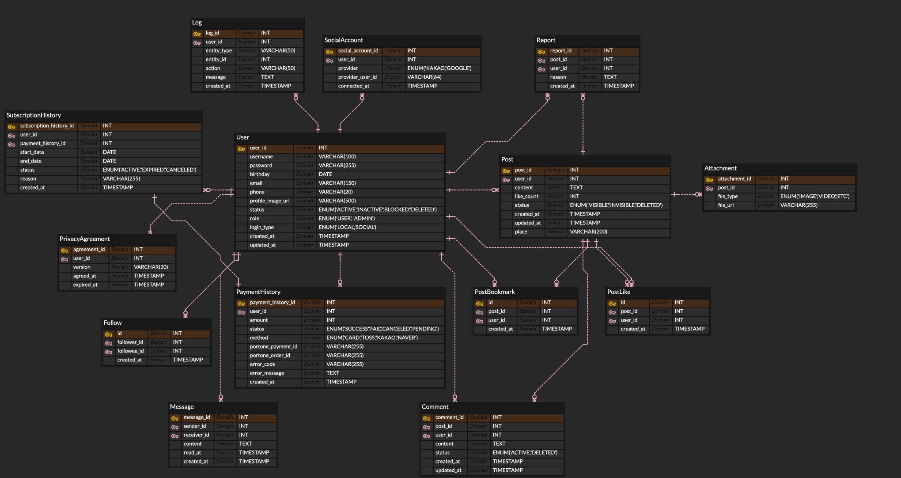

# Gridge Test Server

## 데이터베이스 ERD



## API 문서 확인

- Swagger: [Swagger UI](http://localhost:8080/swagger-ui.html)
- Postman: [Postman Collection](https://.postman.co/workspace/My-Workspace~de85d44d-15c1-450d-87ea-2694673fde04/collection/40062499-a8294960-220f-438f-9912-14e5bc360a29?action=share&creator=40062499&active-environment=40062499-6cf49d97-c33e-4f36-9298-9f87ae1fdae9)

## 프로젝트 구조

```
gridge-test-server/
├── src/
│   └── main/
│       ├── java/com/brs/gridge/
│       │   ├── common/                    # 공통 유틸리티
│       │   │   ├── Constants.java         # 상수 정의
│       │   │   ├── ErrorResponse.java     # 에러 응답 DTO
│       │   │   └── ValidationMessages.java # 유효성 검증 메시지
│       │   ├── config/                    # 설정 클래스
│       │   │   ├── JwtProperties.java     # JWT 설정
│       │   │   ├── PortOneProperties.java # PortOne 결제 설정
│       │   │   ├── SecurityConfig.java    # Spring Security 설정
│       │   │   └── SwaggerConfig.java     # API 문서화 설정
│       │   ├── controller/                # REST API 컨트롤러
│       │   │   ├── dto/                   # 요청/응답 DTO
│       │   │   │   ├── ApiResponse.java   # 공통 API 응답
│       │   │   │   ├── CreatePostRequest.java
│       │   │   │   ├── SignupRequest.java
│       │   │   │   └── ... (기타 DTO들)
│       │   │   ├── AuthController.java    # 인증 관련 API
│       │   │   ├── PostController.java    # 게시글 관련 API
│       │   │   ├── UserController.java    # 사용자 관련 API
│       │   │   ├── CommentController.java # 댓글 관련 API
│       │   │   ├── ReportController.java  # 신고 관련 API
│       │   │   ├── SubscriptionController.java # 구독 관련 API
│       │   │   └── LogController.java     # 로그 관련 API
│       │   ├── domain/                    # 도메인 모델
│       │   │   ├── entity/                # JPA 엔티티
│       │   │   │   ├── User.java          # 사용자 엔티티
│       │   │   │   ├── Post.java          # 게시글 엔티티
│       │   │   │   ├── Comment.java       # 댓글 엔티티
│       │   │   │   ├── PaymentHistory.java # 결제 이력 엔티티
│       │   │   │   └── ... (기타 엔티티들)
│       │   │   └── vo/                    # Value Object
│       │   │       ├── UserStatus.java    # 사용자 상태
│       │   │       ├── PostStatus.java    # 게시글 상태
│       │   │       └── ... (기타 VO들)
│       │   ├── repository/                # 데이터 접근 계층
│       │   │   ├── UserRepository.java    # 사용자 리포지토리
│       │   │   ├── PostRepository.java    # 게시글 리포지토리
│       │   │   └── ... (기타 리포지토리들)
│       │   ├── security/                  # 보안 관련
│       │   │   ├── JwtTokenProvider.java  # JWT 토큰 관리
│       │   │   └── JwtAuthenticationFilter.java # JWT 인증 필터
│       │   ├── service/                   # 비즈니스 로직 계층
│       │   │   ├── AuthService.java       # 인증 서비스
│       │   │   ├── PostService.java       # 게시글 서비스
│       │   │   ├── UserService.java       # 사용자 서비스
│       │   │   ├── SubscriptionService.java # 구독 서비스
│       │   │   └── ... (기타 서비스들)
│       │   └── GridgeApplication.java     # 메인 애플리케이션
│       └── resources/
│           ├── application.properties     # 애플리케이션 설정
│           └── test-data.sql             # 테스트 데이터
├── build.gradle                          # Gradle 빌드 설정
├── gradlew                              # Gradle Wrapper (Unix)
├── gradlew.bat                          # Gradle Wrapper (Windows)
└── README.md                            # 프로젝트 문서
```

## 폴더별 기능 정의

### 📁 common/

- **Constants.java**: 애플리케이션 전반에서 사용되는 상수들을 중앙 관리
- **ErrorResponse.java**: API 에러 응답을 위한 공통 DTO
- **ValidationMessages.java**: 유효성 검증 메시지 상수

### 📁 config/

- **SecurityConfig.java**: Spring Security 설정 (JWT, CORS, 인증/인가)
- **JwtProperties.java**: JWT 토큰 관련 설정 프로퍼티
- **PortOneProperties.java**: PortOne 결제 시스템 설정
- **SwaggerConfig.java**: API 문서화 설정

### 📁 controller/

- **AuthController.java**: 회원가입, 로그인, 비밀번호 재설정
- **PostController.java**: 게시글 CRUD, 좋아요, 북마크, 신고
- **UserController.java**: 사용자 관리, 프로필 조회/수정
- **CommentController.java**: 댓글 CRUD
- **SubscriptionController.java**: 구독 관리, 결제 처리
- **ReportController.java**: 신고 관리 (관리자용)
- **LogController.java**: 시스템 로그 조회 (관리자용)

### 📁 domain/

- **entity/**: JPA 엔티티 (데이터베이스 테이블과 매핑)
- **vo/**: Value Object (상태, 타입 등)

### 📁 repository/

- Spring Data JPA 리포지토리 인터페이스
- 데이터베이스 쿼리 메서드 정의

### 📁 security/

- JWT 토큰 생성/검증 로직
- 인증 필터 구현

### 📁 service/

- 비즈니스 로직 구현
- 트랜잭션 관리
- 외부 API 연동

## 환경 설정

### 데이터베이스 설정

## 실행 방법

### 1. 사전 요구사항

- Java 17 이상
- MySQL 8.0 이상
- Gradle 8.0 이상

### 2. 데이터베이스 설정

### 3. 애플리케이션 실행

## 주요 기능

### 인증/인가

- JWT 기반 인증
- 역할 기반 접근 제어 (USER, ADMIN)

### 게시글 관리

- 게시글 CRUD
- 이미지/동영상 첨부
- 좋아요, 북마크, 댓글
- 신고 기능

### 구독 시스템

- 월 구독 (9,900원)
- 구독 상태 관리

### 관리자 기능

- 사용자 관리
- 게시글/댓글 관리
- 신고 처리
- 시스템 로그 조회
